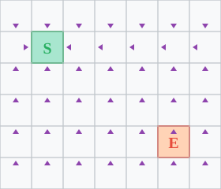

## Recap: The Maze Explorer

Last week, we explored a maze using different **containers**:

| Container | Order | Behavior |
|-----------|-------|----------|
| Bag | Random | Chaotic |
| Stack | LIFO | Go deep, backtrack |
| Queue | FIFO | Explore by distance |

Today: What made this work, and where else can we use it?

## {background-iframe="viz/maze_explorer.html" background-interactive="true"}

## Whatever-First Search

```python
def whatever_first_search(start, neighbors):
    bag = Bag([start])
    visited = {start}

    while bag:
        current = bag.get()
        for neighbor in neighbors(current):
            if neighbor not in visited:
                visited.add(neighbor)
                bag.put(neighbor)

    return visited
```

*Adapted from [Jeff Erickson's Algorithms](https://jeffe.cs.illinois.edu/teaching/algorithms/)*

## The Key Insight

The algorithm structure is **always the same**.

Three things change:

1. **The bag**: What state do we process next?
2. **The neighbors**: What's adjacent to the current state?
3. **The bookkeeping**: What do we track about each state?

## Designing Your Search: A Checklist

| Question | Your answer |
|----------|-------------|
| What is a **state**? | |
| What are the **neighbors** of a state? | |
| What **bag** should I use? | |
| What do I need to **track**? | |
| When do I **mark visited**? | |
| When do I **stop**? | |

## Choosing the Bag

| Bag Type | Name | Behavior |
|----------|------|----------|
| Stack | Depth-First Search | Go deep, backtrack |
| Queue | Breadth-First Search | Explore by distance |
| Priority Queue | Best-First Search | Explore by "goodness" |

## Choosing the Bookkeeping

| Question | What to track |
|----------|---------------|
| "Can I reach X?" | `visited` (set) |
| "How far is X?" | `distance` (dict: state → int) |
| "What's the path to X?" | `parent` (dict: state → state) |
| "When did I discover X?" | `discovery_time` (dict: state → int) |
| "When did I finish X?" | `finish_time` (dict: state → int) |

**The question determines the data structures.**

## When to Mark Visited?

Two choices:

```python
# Option A: Mark when adding to bag
if neighbor not in visited:
    visited.add(neighbor)
    bag.put(neighbor)

# Option B: Mark when removing from bag
current = bag.get()
if current not in visited:
    visited.add(current)
```

**Option A** (our version today): Each state enters bag once.

**Option B**: Each *transition* adds to bag once (so states can appear multiple times).

## What Is a "Thing"? (State)

The "thing" in the bag is whatever describes where you are:

| Domain | State (the "thing") |
|--------|---------------------|
| Maze | Room number |
| Grid | (row, col) position |
| Social network | Person |
| Tower of Hanoi | Configuration of all disks |
| Word ladder | Current word |

**State** = everything needed to know "where am I now?"

## What Are "Neighbors"?

The `neighbors(state)` function says what's reachable in one step:

| Domain | Neighbors of state |
|--------|-------------------|
| Maze | Rooms connected to current room |
| Grid | Cells adjacent to (row, col) |
| Social network | Friends of current person |
| Tower of Hanoi | Configurations after one valid move |
| Word ladder | Words differing by one letter |

The problem defines what "one step" means.


## An Example Problem

**How do we find the shortest path from S to E in a grid?**

```{=html}
<svg viewBox="0 0 280 240" xmlns="http://www.w3.org/2000/svg" style="max-width: 300px; height: auto;">
  <!-- Grid lines -->
  <defs>
    <pattern id="grid" width="40" height="40" patternUnits="userSpaceOnUse">
      <rect width="40" height="40" fill="#f8f9fa" stroke="#dee2e6" stroke-width="1"/>
    </pattern>
  </defs>
  <rect width="280" height="240" fill="url(#grid)"/>

  <!-- Start cell highlight -->
  <rect x="40" y="40" width="40" height="40" fill="#a8e6cf" stroke="#27ae60" stroke-width="2"/>

  <!-- End cell highlight -->
  <rect x="200" y="160" width="40" height="40" fill="#ffd3b6" stroke="#e74c3c" stroke-width="2"/>

  <!-- S label -->
  <text x="60" y="68" text-anchor="middle" font-size="20" font-weight="bold" fill="#27ae60">S</text>

  <!-- E label -->
  <text x="220" y="188" text-anchor="middle" font-size="20" font-weight="bold" fill="#e74c3c">E</text>

</svg>
```

Let's fill out our checklist...

## Step 1: What is a state?

| Question | Answer |
|----------|--------|
| What is a **state**? | `(row, col)` position |
| What are the **neighbors**? | |
| What **bag**? | |
| What do I **track**? | |
| When **mark visited**? | |
| When do I **stop**? | |

A state is a cell: `(row, col)`.

## Step 2: What are the neighbors?

::::: {.columns}
::: {.column width=55%}
| Question | Answer |
|----------|--------|
| What is a **state**? | `(row, col)` position |
| What are the **neighbors**? | 4-connected |
| What **bag**? | |
| What do I **track**? | |
| When **mark visited**? | |
| When do I **stop**? | |
:::
::: {.column width=45%}
```{=html}
<svg viewBox="0 0 200 200" xmlns="http://www.w3.org/2000/svg" style="max-width: 160px; height: auto;">
  <!-- Grid background -->
  <defs>
    <pattern id="grid-neighbors" width="40" height="40" patternUnits="userSpaceOnUse">
      <rect width="40" height="40" fill="#f8f9fa" stroke="#dee2e6" stroke-width="1"/>
    </pattern>
  </defs>
  <rect width="200" height="200" fill="url(#grid-neighbors)"/>

  <!-- Center cell C -->
  <rect x="80" y="80" width="40" height="40" fill="#3498db" stroke="#2980b9" stroke-width="2"/>
  <text x="100" y="108" text-anchor="middle" font-size="18" font-weight="bold" fill="white">C</text>

  <!-- Neighbor cells marked with X -->
  <rect x="80" y="40" width="40" height="40" fill="#a8e6cf" stroke="#27ae60" stroke-width="2"/>
  <text x="100" y="68" text-anchor="middle" font-size="16" font-weight="bold" fill="#27ae60">X</text>

  <rect x="80" y="120" width="40" height="40" fill="#a8e6cf" stroke="#27ae60" stroke-width="2"/>
  <text x="100" y="148" text-anchor="middle" font-size="16" font-weight="bold" fill="#27ae60">X</text>

  <rect x="40" y="80" width="40" height="40" fill="#a8e6cf" stroke="#27ae60" stroke-width="2"/>
  <text x="60" y="108" text-anchor="middle" font-size="16" font-weight="bold" fill="#27ae60">X</text>

  <rect x="120" y="80" width="40" height="40" fill="#a8e6cf" stroke="#27ae60" stroke-width="2"/>
  <text x="140" y="108" text-anchor="middle" font-size="16" font-weight="bold" fill="#27ae60">X</text>
</svg>
```
:::
:::::

From `(r, c)`, neighbors are `(r±1, c)` and `(r, c±1)`.

## Step 3: What bag?

We want **shortest paths**.

The **distance** from A to B is the minimum number of steps.

```{=html}
<svg viewBox="0 0 200 200" xmlns="http://www.w3.org/2000/svg" style="max-width: 220px; height: auto;">
  <!-- Grid background -->
  <defs>
    <pattern id="grid-dist" width="40" height="40" patternUnits="userSpaceOnUse">
      <rect width="40" height="40" fill="#f8f9fa" stroke="#dee2e6" stroke-width="1"/>
    </pattern>
  </defs>
  <rect width="200" height="200" fill="url(#grid-dist)"/>

  <!-- Distance coloring - darker = closer -->
  <!-- Row 0: 4 3 2 3 4 -->
  <rect x="0" y="0" width="40" height="40" fill="#ffeaa7"/>
  <rect x="40" y="0" width="40" height="40" fill="#fdcb6e"/>
  <rect x="80" y="0" width="40" height="40" fill="#f39c12"/>
  <rect x="120" y="0" width="40" height="40" fill="#fdcb6e"/>
  <rect x="160" y="0" width="40" height="40" fill="#ffeaa7"/>

  <!-- Row 1: 3 2 1 2 3 -->
  <rect x="0" y="40" width="40" height="40" fill="#fdcb6e"/>
  <rect x="40" y="40" width="40" height="40" fill="#f39c12"/>
  <rect x="80" y="40" width="40" height="40" fill="#e67e22"/>
  <rect x="120" y="40" width="40" height="40" fill="#f39c12"/>
  <rect x="160" y="40" width="40" height="40" fill="#fdcb6e"/>

  <!-- Row 2: 2 1 0 1 2 -->
  <rect x="0" y="80" width="40" height="40" fill="#f39c12"/>
  <rect x="40" y="80" width="40" height="40" fill="#e67e22"/>
  <rect x="80" y="80" width="40" height="40" fill="#d35400"/>
  <rect x="120" y="80" width="40" height="40" fill="#e67e22"/>
  <rect x="160" y="80" width="40" height="40" fill="#f39c12"/>

  <!-- Row 3: 3 2 1 2 3 -->
  <rect x="0" y="120" width="40" height="40" fill="#fdcb6e"/>
  <rect x="40" y="120" width="40" height="40" fill="#f39c12"/>
  <rect x="80" y="120" width="40" height="40" fill="#e67e22"/>
  <rect x="120" y="120" width="40" height="40" fill="#f39c12"/>
  <rect x="160" y="120" width="40" height="40" fill="#fdcb6e"/>

  <!-- Row 4: 4 3 2 3 4 -->
  <rect x="0" y="160" width="40" height="40" fill="#ffeaa7"/>
  <rect x="40" y="160" width="40" height="40" fill="#fdcb6e"/>
  <rect x="80" y="160" width="40" height="40" fill="#f39c12"/>
  <rect x="120" y="160" width="40" height="40" fill="#fdcb6e"/>
  <rect x="160" y="160" width="40" height="40" fill="#ffeaa7"/>

  <!-- Grid lines on top -->
  <g stroke="#bdc3c7" stroke-width="1" fill="none">
    <line x1="40" y1="0" x2="40" y2="200"/>
    <line x1="80" y1="0" x2="80" y2="200"/>
    <line x1="120" y1="0" x2="120" y2="200"/>
    <line x1="160" y1="0" x2="160" y2="200"/>
    <line x1="0" y1="40" x2="200" y2="40"/>
    <line x1="0" y1="80" x2="200" y2="80"/>
    <line x1="0" y1="120" x2="200" y2="120"/>
    <line x1="0" y1="160" x2="200" y2="160"/>
    <rect x="0" y="0" width="200" height="200"/>
  </g>

  <!-- Distance numbers -->
  <g font-size="16" font-weight="bold" text-anchor="middle" fill="#2c3e50">
    <!-- Row 0 -->
    <text x="20" y="26">4</text><text x="60" y="26">3</text><text x="100" y="26">2</text><text x="140" y="26">3</text><text x="180" y="26">4</text>
    <!-- Row 1 -->
    <text x="20" y="66">3</text><text x="60" y="66">2</text><text x="100" y="66">1</text><text x="140" y="66">2</text><text x="180" y="66">3</text>
    <!-- Row 2 -->
    <text x="20" y="106">2</text><text x="60" y="106">1</text><text x="100" y="106" fill="white">0</text><text x="140" y="106">1</text><text x="180" y="106">2</text>
    <!-- Row 3 -->
    <text x="20" y="146">3</text><text x="60" y="146">2</text><text x="100" y="146">1</text><text x="140" y="146">2</text><text x="180" y="146">3</text>
    <!-- Row 4 -->
    <text x="20" y="186">4</text><text x="60" y="186">3</text><text x="100" y="186">2</text><text x="140" y="186">3</text><text x="180" y="186">4</text>
  </g>
</svg>
```

How do we explore in order of distance?

::: notes
we only want to mark something as distance 2 when we know it can't be distance 1, so we have to find ALL the distance 1s first, before we mark any as distance 2. distance 1s have to be a neighbor of a distance 0...
:::


## Why Queues Give Distances

When we use a **queue**:

- We process all distance-1 cells before any distance-2 cells
- We process all distance-2 cells before any distance-3 cells
- And so on...

This is **Breadth-First Search (BFS)**.

## BFS Gives Shortest Paths

**Observe**: When BFS discovers a state, the recorded distance is the shortest path distance.

**Why?**

- BFS explores in order: all distance-1 before any distance-2, etc.
- If there were a shorter path, we would have found it earlier!

## Step 3: What bag? (answered)

| Question | Answer |
|----------|--------|
| What is a **state**? | `(row, col)` position |
| What are the **neighbors**? | 4-connected adjacent cells |
| What **bag**? | Queue (FIFO) → BFS |
| What do I **track**? | |
| When **mark visited**? | |
| When do I **stop**? | |

Queue gives us shortest paths!

## Step 4: What do I track?

| Question | Answer |
|----------|--------|
| What is a **state**? | `(row, col)` position |
| What are the **neighbors**? | 4-connected adjacent cells |
| What **bag**? | Queue (FIFO) → BFS |
| What do I **track**? | `distance` dict, `parent` dict |
| When **mark visited**? | |
| When do I **stop**? | |

- `distance`: how far is each cell?
- `parent`: how do I get there? (for path reconstruction)

## Step 5: When mark visited?

| Question | Answer |
|----------|--------|
| What is a **state**? | `(row, col)` position |
| What are the **neighbors**? | 4-connected adjacent cells |
| What **bag**? | Queue (FIFO) → BFS |
| What do I **track**? | `distance` dict, `parent` dict |
| When **mark visited**? | When adding to queue |
| When do I **stop**? | |

Mark visited when adding → each cell enters queue once.

## Step 6: When do I stop?

| Question | Answer |
|----------|--------|
| What is a **state**? | `(row, col)` position |
| What are the **neighbors**? | 4-connected adjacent cells |
| What **bag**? | Queue (FIFO) → BFS |
| What do I **track**? | `distance` dict, `parent` dict |
| When **mark visited**? | When adding to queue |
| When do I **stop**? | Goal found (or queue empty) |

**Checklist complete!** Now let's write the code.

## BFS on a Grid

::::: {.columns}
::: {.column width=55%}
```python
from collections import deque

def bfs(grid, start, end):
    rows, cols = len(grid), len(grid[0])
    distance = {start: 0}
    parent = {start: None}
    queue = deque([start])

    while queue:
        r, c = queue.popleft()
        if (r, c) == end:
            return distance, parent
        for nr, nc in neighbors(r, c, rows, cols):
            if (nr, nc) not in distance:
                distance[(nr, nc)] = distance[(r, c)] + 1
                parent[(nr, nc)] = (r, c)
                queue.append((nr, nc))

    return distance, parent
```
:::
::: {.column width=45%}
{width=100%}

Each arrow points to **parent**: the cell that discovered it.
:::
:::::

## Reconstructing the Path

```python
def get_path(parent, end):
    # Follow parent pointers, pushing onto stack
    stack = []
    current = end
    while current is not None:
        stack.append(current)
        current = parent[current]

    # Pop from stack to reverse the path
    path = []
    while stack:
        path.append(stack.pop())
    return path
```

Use a **stack** to reverse the parent pointers!

## The Neighbor Function

```python
def grid_neighbors(r, c, rows, cols):
    """4-connected neighbors on a grid."""
    for dr, dc in [(-1,0), (1,0), (0,-1), (0,1)]:
        nr, nc = r + dr, c + dc
        if is_valid(nr, nc, rows, cols):
            yield (nr, nc)

def is_valid(r, c, rows, cols):
    return 0 <= r < rows and 0 <= c < cols
```

Two design decisions:

- **Candidates**: 4-connected? 8-connected? Knight moves?
- **Validity**: In bounds? Not a wall? Climbable?

# Love Letters in the Mountains

## {background-iframe="viz/love_letters_bfs.html" background-interactive="true"}

## Your Turn {.activity}

Help Donkey find the shortest path to Dragon's castle!

Complete the [activity in PL](https://us.prairielearn.com/pl/course_instance/205477/assessment/2645472) to solve the puzzle!

## The Story

::::: {.columns}
::: {.column width=60%}
Donkey must deliver a love letter to Dragon through mountainous terrain.

- Start at village **S** in a valley
- Deliver to Dragon's castle **E** on a peak
- Each step: move to adjacent cell
- **Constraint**: Donkey can only climb one elevation level at a time!
:::
::: {.column width=40%}
```
aabqponm
abcryxxl
accszzxk
acctuvwj
abdefghi
```
(heights: a=0, b=1, ..., z=25)
:::
:::::

## The Terrain Rules

From height `h`, you can step to a neighbor with height at most `h + 1`.

- From `a` (height 0): can reach `a` or `b`
- From `c` (height 2): can reach `a`, `b`, `c`, or `d`
- From `z` (height 25): can reach anything!

This changes what "neighbors" means.

## Part 1: Exploring the Valley

**Question**: Starting from S, how many locations can the messenger reach in at most 10 steps?

This is BFS with a **step limit**.

## Part 2: Finding the Castle

**Question**: What is the shortest path from S to E?

This is BFS for **shortest path**.

(Stop when we reach E, return the distance.)

## Part 3: The Scenic Route

Donkey wants to start from a valley—but which one?

**Question**: Which `a` cell has the shortest path to Dragon's castle E?

## A Clever Observation

Option 1: Run BFS from every `a` cell, take minimum.
(Slow if there are many `a` cells!)

Option 2: Run BFS **backwards** from E.

- Use reversed edges: if A→B exists, search B→A
- Find all cells that *can reach* E
- Check which `a` cell is closest

## Reversing the Edges

**Forward edge** (A can reach B):
- From height `h`, can step to height ≤ `h + 1`

**Backward edge** (who can reach me?):
- From height `h`, can step to height ≥ `h - 1`

Same algorithm, different neighbor function!

## The Power of Abstraction

Both problems use the same BFS template:

1. **Bag**: Queue (for shortest paths)
2. **Neighbors**: Defined by terrain rules
3. **Termination**: Goal reached or all reachable

Only the neighbor function changes!

## Neighbors Are Everywhere

| Problem | "State" | Neighbors |
|---------|---------|-----------|
| Grid maze | (row, col) | Adjacent cells |
| Word ladder | "COLD" | Words 1 letter away |
| Tower of Hanoi | Disk positions | Valid moves |
| Rubik's cube | Cube state | Single rotations |
| Social network | Person | Friends |

**If you can define neighbors, you can search.**

## Summary: Whatever-First Search

The same algorithm works everywhere:

1. **Define your state** (position, game configuration, ...)
2. **Define neighbors** (what's reachable in one step?)
3. **Choose your bag**:
   - Stack → DFS (explore deeply)
   - Queue → BFS (explore by distance)
   - Priority queue → Best-first (explore by cost)

**BFS** with a queue finds shortest paths!

## Lab Preview

In lab this week, you'll implement:

- Tower of Hanoi game (state transitions)
- Sliding window problems (queue applications)
- Nearest smaller element (stack pattern)
- Histogram max area (stack application)

## What's Next

- **Tuesday video**: The Magic of O(1) Lookup — Dictionaries
- **Wednesday**: Dictionary Puzzles — Two-Sum, anagrams, frequency counting

