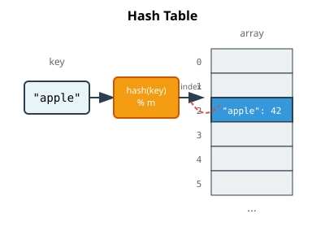
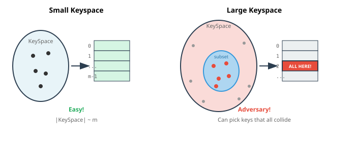
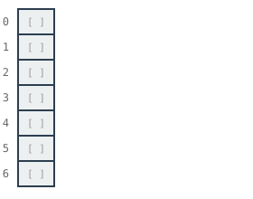
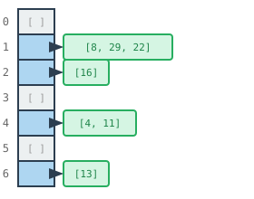
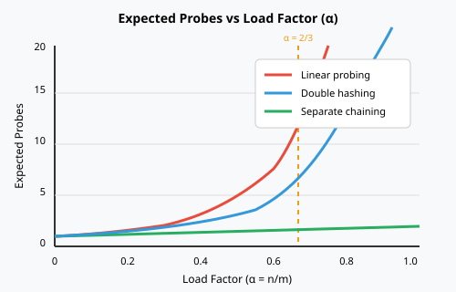
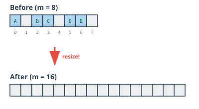

## The Dictionary Dream

What if we could do this?

| Operation | Time |
|-----------|------|
| Insert    | O(1) |
| Find      | O(1) |
| Delete    | O(1) |

No searching. No sorting. Just... *know* where everything is.

## Python's `dict` and `set`

You've been using this magic all along:

```python
seen = set()
seen.add("apple")      # O(1)
"apple" in seen        # O(1)

ages = {}
ages["Alice"] = 25     # O(1)
ages["Alice"]          # O(1) → 25
```

**How does this work?**

## A Hash Table

::: notes
I'll annotate the diagram on the right to show what's happening as we trace through the code. Bottom line: "we call this setup a hash table." Other names: associative array (the interface), hashmap, or just map.

i'll also point out that everthing is O(1)!
:::

::::: {.columns}
::: {.column width=50%}
```python
ages = {}
ages["Alice"] = 25
ages["Bob"] = 30
print(ages["Alice"])  # → 25
```

A **hash table** consists of:

1. An **array** of slots
2. A **hash function**: key → index
3. ??


:::
::: {.column width=50%}
{width=100%}
:::
:::::

## What's a Hash Function?

A function that turns any key into an integer.

```python
hash("hello")      # → 8743927429234
hash("world")      # → -3847293742938
hash(42)           # → 42
hash((1, 2, 3))    # → 529344067295497451
```

Then we use `% m` to fit it into our array of size m.

::: notes
We discussed hash functions in detail in DSCI 220, but I'll remind you of the key results.
:::

## What Makes a Good Hash Function?

1. **Spreads data uniformly** across the table (SUHA)
2. **Computed in O(1)** time
3. **Deterministic**: if `k1 == k2`, then `h(k1) == h(k2)`

But "spreads uniformly" doesn't mean two keys *won't* land in the same cell...

## The Adversary Problem {.smaller}

::: notes
Use this to explain why we need universal hashing. A nefarious person who knows our hash function could deliberately choose keys that all hash to the same slot → O(n) worst case!
:::

{width=90%}

**Solution**: **Universal hashing** — randomly choose the hash function at runtime.

The adversary can't predict which keys will collide!

## The Problem: Collisions

What if two keys hash to the same index?

```python
hash("apple") % 7  # → 3
hash("grape") % 7  # → 3  # Uh oh!
```

This is called a **collision**.

With only $\sqrt{m}$ keys in a table of size $m$, we *expect* at least one collision.

(This is the birthday paradox you saw in DSCI 220!)

::: notes
i'm going to rewrite this in annotation to be with data of size n, even a table of size n^2 isn't adequate to make collisions rare. 
:::

## Collisions Are Inevitable

Even with a "good" hash function, collisions happen.

**Why?** Because we're mapping a huge keyspace into a small array.

- Possible strings: practically infinite
- Array size: maybe 1000 slots

We need a **collision resolution strategy**.

::: notes
two general approaches, a) use the cells as buckets, or b) put the key in some other cell (turn the hash function into a hash process)
:::

## Strategy: Separate Chaining

Each slot holds a **list** of items that hash there.

::::: {.columns}
::: {.column width=55%}
Insert `{16, 8, 4, 13, 29, 11, 22}` with `h(k) = k % 7`:


:::
::: {.column width=45%}
{width=100%}
:::
:::::

## Separate Chaining: Analysis {.smaller}

::::: {.columns}
::: {.column width=55%}
To **find** a key:

1. Hash to get the slot: O(1)
2. Search the list at that slot: O(length of list)

**Key question:** How long are the lists?
:::
::: {.column width=45%}
{width=100%}
:::
:::::

## The Load Factor {.smaller}

::::: {.columns}
::: {.column width=55%}
**Load factor** $\alpha = n/m$

- $n$ = number of items stored
- $m$ = number of slots (array size)

If items are spread evenly, each list has length $\approx \alpha$.

**Under uniform hashing assumption:**

- Expected time to find = $O(1 + \alpha)$
:::
::: {.column width=45%}
{width=100%}
:::
:::::

## Strategy: Linear Probing

Instead of chaining, store items *directly in the array*.

If slot `h(k)` is full, try `h(k)+1`, then `h(k)+2`, ...

```python
def insert(key, value):
    i = hash(key) % m
    while array[i] is not None:
        i = (i + 1) % m  # probe next slot
    array[i] = (key, value)
```

**Advantage**: No linked lists, better cache performance.

**Disadvantage**: Clustering — full regions grow and merge.

## Linear Probing: Watch and Listen {background-iframe="viz/linear_probing.html"}

::: notes
This visualization inserts 1000 items into a table of size 1000. Listen for when insertion becomes "too slow." Students inevitably identify ~2/3 as the threshold — which matches the analytical result!
:::

## Double Hashing: Watch and Listen {background-iframe="viz/double_hashing.html"}

::: notes
Now let's try double hashing. Notice it doesn't slow down as dramatically — the probes stay short even at higher load factors because we avoid clustering.
:::

## The Secret to O(1): Keep $\alpha$ Constant! {.smaller}

Remember: $\alpha = n/m$

- **$n$** = number of items (we can't control this — users insert what they want!)
- **$m$** = table size (we *can* control this)

If we keep $\alpha$ constant (say, $\alpha \le 2/3$), then:

- Expected probes = $O(1)$
- Expected find time = $O(1)$
- Expected insert time = $O(1)$

**But wait...** as $n$ grows, $\alpha$ grows! Unless we grow $m$ too...

## Performance vs Load Factor

::: notes
As $\alpha$ increases, expected probes increase. Linear probing degrades faster than double hashing or chaining. The key insight: all strategies blow up as $\alpha \to 1$.
:::

{width=80%}

## The Punchline: Resizing {.smaller}

::: notes
again, i like the way i did this in old slides.
:::

::::: {.columns}
::: {.column width=55%}
The old message:

1. When the array fills, 
1. **Double** the array size
2. **Copy** all items to the new array

This single resize costs O(n)...
:::
::: {.column width=45%}
{width=100%}
:::
:::::

## Amortized O(1)

You've seen this movie before! (Dynamic arrays, Week 5)

- Most inserts: O(1)
- Occasional resize: O(n)

Using the same accounting trick:

**Amortized cost per insert = O(1)**

## The Full Picture

Hash table operations are **O(1) expected, amortized**:

| Operation | Time |
|-----------|------|
| Insert    | O(1) expected, amortized |
| Find      | O(1) expected |
| Delete    | O(1) expected |

"Expected" = assuming good hash function
"Amortized" = averaging over many operations

## Why "Expected"?

The O(1) relies on:

1. A good hash function that spreads keys uniformly
2. No adversary choosing keys to cause collisions

In practice, Python's built-in hash functions are excellent.

**Worst case** (all keys collide): O(n) — but this almost never happens.

## Python's Implementation

Python `dict` uses:

- Open addressing (not chaining) — items stored directly in array
- Resizes at $\alpha \approx 2/3$
- Sophisticated probing to handle collisions

You don't need to know the details — just that it's **O(1)**!

::: notes
Python doesn't use linear probing — it uses a variant called **"pseudo-random probing"** or more specifically, a technique based on the full hash value. The probe sequence uses the formula:
`j = ((5*j) + 1 + perturb) % 2**i`
where `perturb` starts as the full hash and gets shifted right each iteration.

This avoids linear probing's clustering problem while maintaining good cache behavior. The key insight: it visits every slot eventually (guaranteed by math), but in a scattered pattern that depends on the full hash value, not just `hash % m`.
:::

## Summary

**Hash tables** give O(1) lookup by:

1. Using a **hash function** to map keys → array indices
2. Handling **collisions** (e.g., with chaining)
3. **Resizing** (double, copy, re-hash) to keep load factor constant

This is the magic behind Python's `dict` and `set`.

## What's Next

**Wednesday**: The dictionary trick in action!

- Two-Sum: O(n²) → O(n)
- Anagram detection
- Frequency counting

The pattern: "Have I seen this before?" = dictionary lookup
