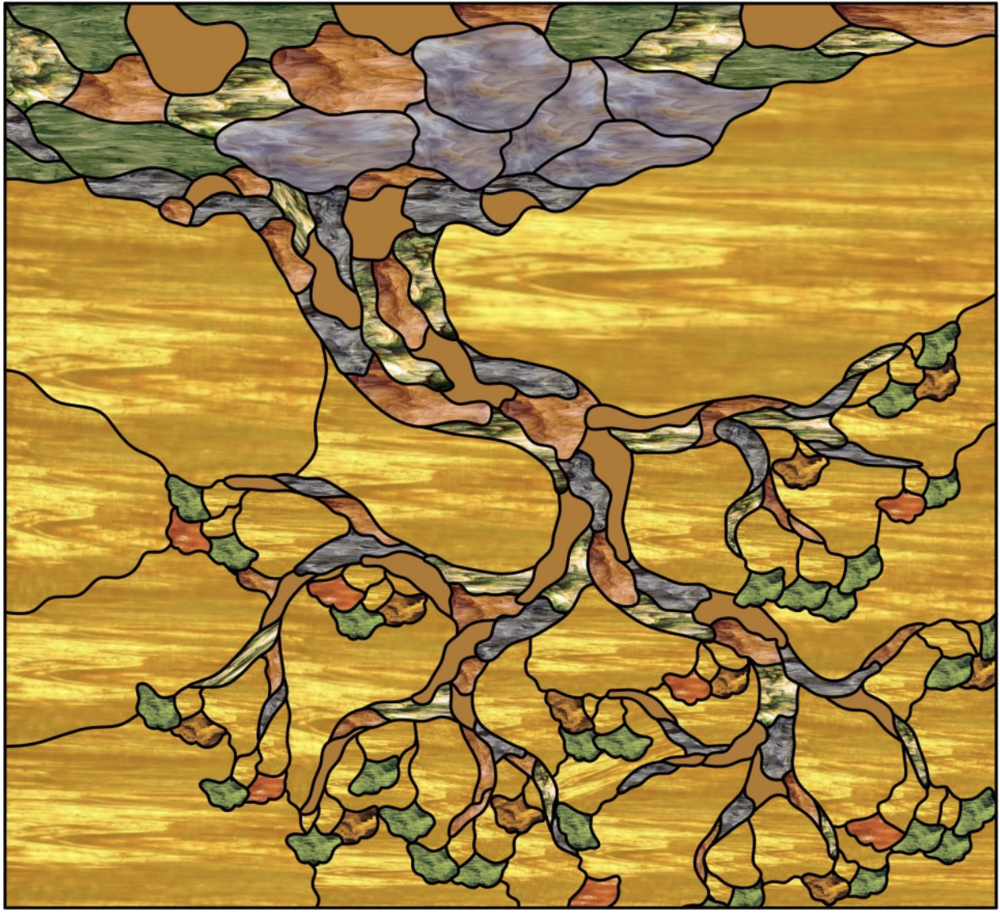

## Announcements

::: {.columns}
::: {.column width="50%"}

**Today:**

- Implementing Trees in Python
- Tree Traversals

:::
::: {.column width="50%"}

{width="80%"}

:::
:::

::: notes
The stained glass tree is a beautiful artistic representation of a tree structure.
:::

## Representing Trees in Python

A tree node has a **value** and **children** (which are themselves trees!).

```python
from dataclasses import dataclass

@dataclass
class Node:
    value
    left: 'Node' = None   # Another Node (or None)
    right: 'Node' = None  # Another Node (or None)
```

This is a **recursive definition**: a Node contains Nodes!

::: notes
This is our first recursive data structure. The definition refers to itself:
a Node has left and right children that are also Nodes (or None for leaves).
This mirrors the recursive definition of a tree itself.

Why the quotes around 'Node'? When Python reads this class definition top-to-bottom,
the name `Node` doesn't exist yet when we try to use it in the type hint. The quotes
make it a "forward reference" — Python defers evaluating it until the class is complete.
:::

## Building a Tree

```python
# Build leaf nodes first
leaf_b = Node('b')
leaf_c = Node('c')
leaf_a = Node('a')
leaf_d = Node('d')
leaf_e = Node('e')

# Build internal nodes bottom-up
div_node = Node('/', leaf_b, leaf_c)
minus_node = Node('-', leaf_a, div_node)
times_node = Node('*', leaf_d, leaf_e)

# Build root
root = Node('+', minus_node, times_node)
```

Or more concisely (inside-out):

```python
root = Node('+',
    Node('-', Node('a'), Node('/', Node('b'), Node('c'))),
    Node('*', Node('d'), Node('e')))
```

::: notes
Two ways to build trees:
1. Bottom-up: create leaves, then parents, then root
2. Nested: write the whole structure inline (matches the tree shape visually)

The nested form is harder to read but shows the recursive structure clearly.
:::

## Tree Traversal

A scheme for **visiting every node** in a tree.

```{=html}
<svg viewBox="0 0 500 380" xmlns="http://www.w3.org/2000/svg" style="max-width: 500px; display: block; margin: 0 auto;">
  <!-- A colorful expression tree: (- a (/ b c)) + (* d e) -->

  <!-- Edges (draw first so nodes cover them) -->
  <!-- Root to children -->
  <line x1="250" y1="50" x2="125" y2="130" stroke="#333" stroke-width="3"/>
  <line x1="250" y1="50" x2="375" y2="130" stroke="#333" stroke-width="3"/>
  <!-- Left subtree -->
  <line x1="125" y1="150" x2="60" y2="230" stroke="#333" stroke-width="3"/>
  <line x1="125" y1="150" x2="190" y2="230" stroke="#333" stroke-width="3"/>
  <!-- Left-right subtree (/) -->
  <line x1="190" y1="250" x2="145" y2="330" stroke="#333" stroke-width="3"/>
  <line x1="190" y1="250" x2="235" y2="330" stroke="#333" stroke-width="3"/>
  <!-- Right subtree -->
  <line x1="375" y1="150" x2="310" y2="230" stroke="#333" stroke-width="3"/>
  <line x1="375" y1="150" x2="440" y2="230" stroke="#333" stroke-width="3"/>

  <!-- Root: + (coral/salmon) -->
  <circle cx="250" cy="45" r="32" fill="#e76f51" stroke="#333" stroke-width="2"/>
  <text x="250" y="55" text-anchor="middle" font-size="28" font-weight="bold" fill="white">+</text>

  <!-- Level 1: - and * (teal and gold) -->
  <circle cx="125" cy="140" r="28" fill="#2a9d8f" stroke="#333" stroke-width="2"/>
  <text x="125" y="150" text-anchor="middle" font-size="24" font-weight="bold" fill="white">-</text>

  <circle cx="375" cy="140" r="28" fill="#f4a261" stroke="#333" stroke-width="2"/>
  <text x="375" y="150" text-anchor="middle" font-size="24" font-weight="bold" fill="white">*</text>

  <!-- Level 2 left: a (leaf) and / (operator) -->
  <circle cx="60" cy="240" r="24" fill="#264653" stroke="#333" stroke-width="2"/>
  <text x="60" y="248" text-anchor="middle" font-size="20" font-weight="bold" fill="white">a</text>

  <circle cx="190" cy="240" r="24" fill="#2a9d8f" stroke="#333" stroke-width="2"/>
  <text x="190" y="248" text-anchor="middle" font-size="20" font-weight="bold" fill="white">/</text>

  <!-- Level 2 right: d and e (leaves) -->
  <circle cx="310" cy="240" r="24" fill="#264653" stroke="#333" stroke-width="2"/>
  <text x="310" y="248" text-anchor="middle" font-size="20" font-weight="bold" fill="white">d</text>

  <circle cx="440" cy="240" r="24" fill="#264653" stroke="#333" stroke-width="2"/>
  <text x="440" y="248" text-anchor="middle" font-size="20" font-weight="bold" fill="white">e</text>

  <!-- Level 3: b and c (leaves under /) -->
  <circle cx="145" cy="340" r="22" fill="#264653" stroke="#333" stroke-width="2"/>
  <text x="145" y="348" text-anchor="middle" font-size="18" font-weight="bold" fill="white">b</text>

  <circle cx="235" cy="340" r="22" fill="#264653" stroke="#333" stroke-width="2"/>
  <text x="235" y="348" text-anchor="middle" font-size="18" font-weight="bold" fill="white">c</text>
</svg>
```

::: notes
This is the "think about a scheme" moment. Don't constrain the order yet. Ask students:
- How would you visit every node exactly once?
- What order makes sense?
- Is there more than one reasonable order?

The tree represents the expression: (a - (b / c)) + (d * e)

Color coding:
- Coral: root (+)
- Teal: operators (-, /)
- Gold: operator (*)
- Dark blue: operands (a, b, c, d, e)
:::

## Three Natural Orders

When visiting a node, we have three choices for when to "process" it:

1. **Before** visiting children
2. **Between** visiting left and right children
3. **After** visiting children

These give us three classic traversals.

## Preorder Traversal

**Pre**order: Process the node **before** its children

```
preorder(node):
    if node is None: return
    process(node)        # Visit node FIRST
    preorder(node.left)
    preorder(node.right)
```

Order: **+ - a / b c * d e**

::: notes
"Pre" = before. We see the root first, then recursively traverse left, then right.
This is like reading a book's table of contents: chapter title, then sections.
:::

## Inorder Traversal

**In**order: Process the node **between** its children

```
inorder(node):
    if node is None: return
    inorder(node.left)
    process(node)        # Visit node IN THE MIDDLE
    inorder(node.right)
```

Order: **a - b / c + d * e**

::: notes
"In" = in the middle. For expression trees, this gives us the infix notation!
For binary search trees (coming next week), this gives us sorted order.
:::

## Postorder Traversal

**Post**order: Process the node **after** its children

```
postorder(node):
    if node is None: return
    postorder(node.left)
    postorder(node.right)
    process(node)        # Visit node LAST
```

Order: **a b c / - d e * +**

::: notes
"Post" = after. We see all descendants before the node itself.
This is like evaluating an expression: compute operands before applying operator.
Also useful for: deleting a tree (delete children before parent), computing sizes.
:::

## Traversal Practice

```{=html}
<svg viewBox="0 0 400 300" xmlns="http://www.w3.org/2000/svg" style="max-width: 350px; display: block; margin: 0 auto;">
  <!-- Tree with numbers for practice -->

  <!-- Edges -->
  <line x1="200" y1="35" x2="100" y2="95" stroke="#333" stroke-width="2"/>
  <line x1="200" y1="35" x2="300" y2="95" stroke="#333" stroke-width="2"/>
  <line x1="100" y1="115" x2="50" y2="175" stroke="#333" stroke-width="2"/>
  <line x1="100" y1="115" x2="150" y2="175" stroke="#333" stroke-width="2"/>
  <line x1="300" y1="115" x2="300" y2="175" stroke="#333" stroke-width="2"/>
  <line x1="150" y1="195" x2="150" y2="255" stroke="#333" stroke-width="2"/>

  <!-- Nodes with different colors -->
  <circle cx="200" cy="30" r="22" fill="#3498db"/>
  <text x="200" y="38" text-anchor="middle" font-size="16" font-weight="bold" fill="white">10</text>

  <circle cx="100" cy="105" r="20" fill="#e74c3c"/>
  <text x="100" y="113" text-anchor="middle" font-size="15" font-weight="bold" fill="white">12</text>

  <circle cx="300" cy="105" r="20" fill="#2ecc71"/>
  <text x="300" y="113" text-anchor="middle" font-size="15" font-weight="bold" fill="white">15</text>

  <circle cx="50" cy="185" r="18" fill="#e74c3c"/>
  <text x="50" y="192" text-anchor="middle" font-size="14" font-weight="bold" fill="white">3</text>

  <circle cx="150" cy="185" r="18" fill="#f39c12"/>
  <text x="150" y="192" text-anchor="middle" font-size="14" font-weight="bold" fill="white">9</text>

  <circle cx="300" cy="185" r="18" fill="#2ecc71"/>
  <text x="300" y="192" text-anchor="middle" font-size="15" font-weight="bold" fill="white">20</text>

  <circle cx="150" cy="265" r="16" fill="#f39c12"/>
  <text x="150" y="272" text-anchor="middle" font-size="14" font-weight="bold" fill="white">7</text>
</svg>
```

**Preorder**: \_\_\_\_\_\_\_\_\_\_\_\_\_\_\_\_\_\_\_\_\_\_

**Inorder**: \_\_\_\_\_\_\_\_\_\_\_\_\_\_\_\_\_\_\_\_\_\_

**Postorder**: \_\_\_\_\_\_\_\_\_\_\_\_\_\_\_\_\_\_\_\_\_\_

::: notes
Answers:
- Preorder: 10, 12, 3, 9, 7, 15, 20
- Inorder: 3, 12, 7, 9, 10, 15, 20
- Postorder: 3, 7, 9, 12, 20, 15, 10
:::

## The Euler Tour Trick

Walk around the tree, hugging the edges:

- **Preorder**: Record node when passing on the **left**
- **Inorder**: Record node when passing **below**
- **Postorder**: Record node when passing on the **right**

```{=html}
<svg viewBox="0 0 300 180" xmlns="http://www.w3.org/2000/svg" style="max-width: 280px; display: block; margin: 0 auto;">
  <!-- Simple tree with Euler tour visualization hint -->

  <!-- Edges -->
  <line x1="150" y1="35" x2="75" y2="95" stroke="#333" stroke-width="2"/>
  <line x1="150" y1="35" x2="225" y2="95" stroke="#333" stroke-width="2"/>
  <line x1="75" y1="115" x2="40" y2="155" stroke="#333" stroke-width="2"/>
  <line x1="75" y1="115" x2="110" y2="155" stroke="#333" stroke-width="2"/>

  <!-- Nodes -->
  <circle cx="150" cy="30" r="20" fill="#3498db"/>
  <text x="150" y="37" text-anchor="middle" font-size="14" font-weight="bold" fill="white">a</text>

  <circle cx="75" cy="105" r="18" fill="#e74c3c"/>
  <text x="75" y="112" text-anchor="middle" font-size="14" font-weight="bold" fill="white">b</text>

  <circle cx="225" cy="105" r="18" fill="#2ecc71"/>
  <text x="225" y="112" text-anchor="middle" font-size="14" font-weight="bold" fill="white">c</text>

  <circle cx="40" cy="160" r="15" fill="#9b59b6"/>
  <text x="40" y="166" text-anchor="middle" font-size="12" font-weight="bold" fill="white">d</text>

  <circle cx="110" cy="160" r="15" fill="#f39c12"/>
  <text x="110" y="166" text-anchor="middle" font-size="12" font-weight="bold" fill="white">f</text>

  <!-- Labels for Pre/In/Post positions -->
  <text x="130" y="25" font-size="10" fill="#666">Pre</text>
  <text x="150" y="58" font-size="10" fill="#666">In</text>
  <text x="170" y="25" font-size="10" fill="#666">Post</text>
</svg>
```

::: notes
The Euler tour is a mental model for remembering traversal orders.
Imagine walking around the tree counterclockwise, starting at the root.
You pass each node three times: on the left (pre), below (in), on the right (post).
:::

## Traversal Applications

| Traversal | When to Use |
|-----------|-------------|
| **Preorder** | Copy a tree, print directory structure |
| **Inorder** | Get sorted order from BST, infix expression |
| **Postorder** | Delete a tree, evaluate expression, compute sizes |

## Postorder: Deleting a Tree

Why postorder for deletion?

```python
def delete_tree(node):
    if node is None:
        return
    delete_tree(node.left)   # Delete left subtree first
    delete_tree(node.right)  # Delete right subtree first
    del node                 # NOW safe to delete this node
```

**Key insight**: Must delete children before parent!

::: notes
If you deleted the parent first, you'd lose access to the children (memory leak).
Postorder ensures children are processed before parents.
:::

## Preorder: Copying a Tree

Why preorder for copying?

```python
def copy_tree(node):
    if node is None:
        return None
    new_node = Node(node.value)      # Create this node FIRST
    new_node.left = copy_tree(node.left)
    new_node.right = copy_tree(node.right)
    return new_node
```

**Key insight**: Must create parent before attaching children!

::: notes
Actually this is still a form of preorder because we create the node before recursing.
The recursive calls build the subtrees, then we attach them.
:::

## Level Order Traversal

What if we want to visit by **level** (top to bottom, left to right)?

This is **not** recursive in the same way!

We need a **queue** (coming soon...)

Order: **10, 12, 15, 3, 9, 20, 7**

::: notes
Level order traversal uses BFS (breadth-first search) which requires a queue.
We'll cover this when we discuss queues and BFS in more detail.
This connects tree traversal to graph traversal concepts.
:::

## Traversal Running Time

For a tree with n nodes:

- Each node is visited exactly **once**
- Each visit does O(1) work

**Total time: O(n)** for all traversals

::: notes
This is true for pre/in/post/level order.
We touch every node once, do constant work at each.
This is optimal - we can't visit n nodes in less than O(n) time.
:::

## Tuesday Summary

- **Preorder**: Node, then children (copy, print structure)
- **Inorder**: Left, node, right (sorted order in BST)
- **Postorder**: Children, then node (delete, evaluate)
- **Level order**: Top to bottom, left to right (uses queue)
- All traversals are **O(n)**

## What's Next

Wednesday: **Binary Search Trees**

How do we organize a tree so that finding a value is fast?

The key insight: impose an **ordering property** on the tree!
