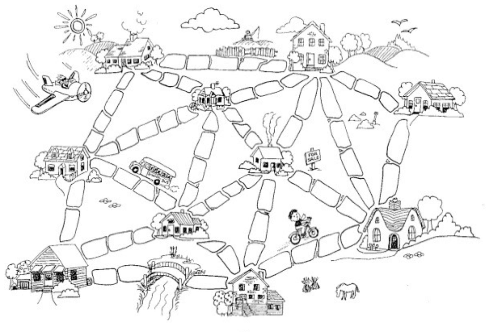

## Announcements {.smaller}

## Muddy City {.smaller}

:::: {.columns}
::: {.column width="58%"}
{width=100%}
:::
::: {.column width="42%"}
**After heavy rain, all roads are muddy.**

You can pave road segments.
Each segment costs a number of paving stones.

**Goal:** pave the fewest total stones so every house can reach every other.

&nbsp;

*Which roads do you pave?*

*How many stones total?*

&nbsp;

[(CS Unplugged activity)](https://classic.csunplugged.org/documents/activities/minimal-spanning-trees/unplugged-09-minimal_spanning_trees-original.pdf)

::: notes
Classic CS Unplugged activity.
Key insight: you never need a cycle. If two houses are already connected,
adding another road between them wastes stones.
So the answer is always a **tree** (connected + acyclic).
The minimum-weight spanning tree.
MST for this graph: edges 2-5(3), 5-8(3), 1-2(4), 3-6(4), 1-4(5), 4-7(5) = total 24.
:::
:::
::::


## Minimum Spanning Tree {.smaller}

:::: {.columns}
::: {.column width="54%"}
```{=html}
<svg viewBox="0 0 380 320" xmlns="http://www.w3.org/2000/svg"
     style="max-width:100%; font-family:sans-serif; font-size:13px">

  <!-- edges -->
  <g stroke="#555" stroke-width="1.8" fill="none">
    <line x1="190" y1="50"  x2="55"  y2="180"/> <!-- A-B 8 -->
    <line x1="190" y1="50"  x2="190" y2="180"/> <!-- A-C 2 -->
    <line x1="190" y1="50"  x2="325" y2="180"/> <!-- A-D 4 -->
    <line x1="55"  y1="180" x2="190" y2="180"/> <!-- B-C 7 -->
    <line x1="55"  y1="180" x2="105" y2="280"/> <!-- B-E 2 -->
    <line x1="190" y1="180" x2="325" y2="180"/> <!-- C-D 1 -->
    <line x1="190" y1="180" x2="105" y2="280"/> <!-- C-E 3 -->
    <line x1="190" y1="180" x2="265" y2="280"/> <!-- C-F 9 -->
    <line x1="325" y1="180" x2="265" y2="280"/> <!-- D-F 5 -->
  </g>

  <!-- edge weight labels -->
  <g fill="#c0392b" font-size="12" font-weight="bold">
    <text x="112" y="108">8</text>   <!-- A-B -->
    <text x="195" y="122">2</text>   <!-- A-C -->
    <text x="264" y="108">4</text>   <!-- A-D -->
    <text x="118" y="175">7</text>   <!-- B-C -->
    <text x="68"  y="240">2</text>   <!-- B-E -->
    <text x="255" y="175">1</text>   <!-- C-D -->
    <text x="140" y="245">3</text>   <!-- C-E -->
    <text x="215" y="250">9</text>   <!-- C-F -->
    <text x="308" y="245">5</text>   <!-- D-F -->
  </g>

  <!-- nodes -->
  <g fill="white" stroke="#3c78d8" stroke-width="2">
    <circle cx="190" cy="50"  r="18"/>
    <circle cx="55"  cy="180" r="18"/>
    <circle cx="190" cy="180" r="18"/>
    <circle cx="325" cy="180" r="18"/>
    <circle cx="105" cy="280" r="18"/>
    <circle cx="265" cy="280" r="18"/>
  </g>
  <g fill="#3c78d8" font-weight="bold" text-anchor="middle" dominant-baseline="central">
    <text x="190" y="50" >A</text>
    <text x="55"  y="180">B</text>
    <text x="190" y="180">C</text>
    <text x="325" y="180">D</text>
    <text x="105" y="280">E</text>
    <text x="265" y="280">F</text>
  </g>
</svg>
```
:::
::: {.column width="46%"}
**Input:** connected, undirected graph $G$ with edge weights

**Output:** subgraph $G'$ such that:

- $G'$ **spans** $G$ (contains all vertices)
- $G'$ is **connected and acyclic** (a tree)
- $G'$ has **minimum total weight** among all spanning trees

&nbsp;

*What is the MST of this graph?*

*Total weight = \_\_\_\_*

::: notes
MST edges: C-D(1), A-C(2), B-E(2), C-E(3), D-F(5). Total = 13.
A tree on n vertices has exactly n-1 edges.
:::
:::
::::


## MST Structure {.smaller}

:::: {.columns}
::: {.column width="52%"}
```{=html}
<!-- same graph; MST edges bold blue, non-MST dashed gray -->
<svg viewBox="0 0 380 320" xmlns="http://www.w3.org/2000/svg"
     style="max-width:100%; font-family:sans-serif; font-size:13px">

  <!-- non-MST edges: dashed gray -->
  <g stroke="#bbb" stroke-width="1.5" stroke-dasharray="5 4" fill="none">
    <line x1="190" y1="50"  x2="55"  y2="180"/> <!-- A-B 8 -->
    <line x1="55"  y1="180" x2="190" y2="180"/> <!-- B-C 7 -->
    <line x1="190" y1="180" x2="265" y2="280"/> <!-- C-F 9 -->
  </g>
  <!-- A-D: heaviest on cycle A-C-D, highlighted orange dashed -->
  <line x1="190" y1="50" x2="325" y2="180"
        stroke="#e07b20" stroke-width="2.5" stroke-dasharray="6 4" fill="none"/>

  <!-- MST edges: solid blue -->
  <g stroke="#3c78d8" stroke-width="3" fill="none">
    <line x1="190" y1="50"  x2="190" y2="180"/> <!-- A-C 2 -->
    <line x1="55"  y1="180" x2="105" y2="280"/> <!-- B-E 2 -->
    <line x1="190" y1="180" x2="325" y2="180"/> <!-- C-D 1 -->
    <line x1="190" y1="180" x2="105" y2="280"/> <!-- C-E 3 -->
    <line x1="325" y1="180" x2="265" y2="280"/> <!-- D-F 5 -->
  </g>

  <!-- cycle A-C-D shaded -->
  <polygon points="190,50 190,180 325,180"
           fill="#e07b20" opacity="0.08"/>

  <!-- edge weight labels -->
  <g font-size="12" font-weight="bold">
    <text x="112" y="108" fill="#bbb">8</text>
    <text x="195" y="122" fill="#3c78d8">2</text>
    <text x="265" y="108" fill="#e07b20">4</text>  <!-- A-D, orange -->
    <text x="118" y="175" fill="#bbb">7</text>
    <text x="68"  y="240" fill="#3c78d8">2</text>
    <text x="255" y="175" fill="#3c78d8">1</text>
    <text x="140" y="245" fill="#3c78d8">3</text>
    <text x="215" y="250" fill="#bbb">9</text>
    <text x="308" y="245" fill="#3c78d8">5</text>
  </g>

  <!-- nodes -->
  <g fill="white" stroke="#3c78d8" stroke-width="2">
    <circle cx="190" cy="50"  r="18"/>
    <circle cx="55"  cy="180" r="18"/>
    <circle cx="190" cy="180" r="18"/>
    <circle cx="325" cy="180" r="18"/>
    <circle cx="105" cy="280" r="18"/>
    <circle cx="265" cy="280" r="18"/>
  </g>
  <g fill="#3c78d8" font-weight="bold" text-anchor="middle" dominant-baseline="central">
    <text x="190" y="50" >A</text>
    <text x="55"  y="180">B</text>
    <text x="190" y="180">C</text>
    <text x="325" y="180">D</text>
    <text x="105" y="280">E</text>
    <text x="265" y="280">F</text>
  </g>

  <text x="190" y="312" text-anchor="middle" font-size="11" fill="#555"
        font-style="italic">blue = MST &nbsp;|&nbsp; dashed = not in MST</text>
</svg>
```
:::
::: {.column width="48%"}

**Cycle property**

On any cycle, the **maximum-weight edge** is never in the MST.

Cycle A–C–D: weights 2, 1, **4**. &nbsp; Edge A–D ∉ MST. ✓

*Why?* If the max-weight edge were in the MST, removing it breaks the tree into two components — but the rest of the cycle still reconnects them at lower cost.

&nbsp;

**Non-MST edge lower bound**

Adding any non-MST edge $X = (u,v)$ to $T$ creates exactly one cycle.
$X$ must be the **heaviest edge on that cycle**.

*What is the minimum possible weight for edge C–F?*

Path C→F in MST: C–D–F &nbsp; (weights 1, 5). &nbsp; Max = **5**.

So C–F $\geq$ 5 to stay out. &nbsp; Actual C–F = 9 ✓

&nbsp;

**Uniqueness** — if all weights are distinct, the MST is unique.

::: notes
Cycle property → Kruskal's: sort edges, skip if both endpoints already connected.
Cut property (not shown): the min-weight edge crossing any partition is always in the MST → Prim's: grow a set S, always pick cheapest edge leaving S.
C-F lower bound: if C-F were 4, it would replace D-F(5) in the MST.
:::
:::
::::


## MST vs. Shortest Paths {.smaller}

:::: {.columns}
::: {.column width="50%"}
```{=html}
<svg viewBox="0 0 260 200" xmlns="http://www.w3.org/2000/svg"
     style="max-width:100%; font-family:sans-serif; font-size:13px">

  <!-- all edges -->
  <g stroke="#bbb" stroke-width="1.5" fill="none">
    <line x1="50"  y1="60"  x2="210" y2="60"/>  <!-- A-B 5 -->
    <line x1="50"  y1="150" x2="210" y2="150"/> <!-- C-D 5 -->
  </g>
  <!-- MST edges blue -->
  <g stroke="#3c78d8" stroke-width="3" fill="none">
    <line x1="50"  y1="60"  x2="50"  y2="150"/> <!-- A-C 1 -->
    <line x1="210" y1="60"  x2="210" y2="150"/> <!-- B-D 1 -->
    <line x1="50"  y1="60"  x2="210" y2="60"/>  <!-- A-B 5 — part of MST -->
  </g>

  <!-- weight labels -->
  <g font-size="12" font-weight="bold">
    <text x="122" y="52"  fill="#3c78d8">5</text> <!-- A-B -->
    <text x="122" y="167" fill="#bbb">5</text>     <!-- C-D not in MST -->
    <text x="28"  y="110" fill="#3c78d8">1</text>  <!-- A-C -->
    <text x="216" y="110" fill="#3c78d8">1</text>  <!-- B-D -->
  </g>

  <!-- nodes -->
  <g fill="white" stroke="#3c78d8" stroke-width="2">
    <circle cx="50"  cy="60"  r="18"/>
    <circle cx="210" cy="60"  r="18"/>
    <circle cx="50"  cy="150" r="18"/>
    <circle cx="210" cy="150" r="18"/>
  </g>
  <g fill="#3c78d8" font-weight="bold" text-anchor="middle" dominant-baseline="central">
    <text x="50"  y="60" >A</text>
    <text x="210" y="60" >B</text>
    <text x="50"  y="150">C</text>
    <text x="210" y="150">D</text>
  </g>

  <text x="130" y="192" text-anchor="middle" font-size="11" fill="#555" font-style="italic">
    blue = MST (total weight 7)
  </text>
</svg>
```
:::
::: {.column width="50%"}

**MST minimizes total edge weight** — not trip distance.

&nbsp;

Shortest path C → D: &emsp; direct edge = **5**

Path C → D through MST: &emsp; C–A–B–D = 1+5+1 = **7**

&nbsp;

The MST is longer! It was built to minimize *total infrastructure*, not *any particular journey*.

&nbsp;

| Question | Use |
|---|---|
| Connect all nodes cheaply | MST |
| Shortest route A → B | Dijkstra's |

::: notes
MST ≠ all-pairs shortest paths.
The MST C-D path goes "the long way" because C-D wasn't chosen — its weight equals A-B, so we arbitrarily included A-B and got the same total weight.
A cleaner example: make C-D weight 6 — then MST is {A-C(1), B-D(1), A-B(5)}, MST path C→D = 7 vs. shortest = 6.
:::
:::
::::


## Partition Property (Cut Property) {.smaller}

:::: {.columns}
::: {.column width="52%"}
```{=html}
<!-- same graph; S={A} highlighted; crossing edges coloured by weight rank -->
<svg viewBox="0 0 380 320" xmlns="http://www.w3.org/2000/svg"
     style="max-width:100%; font-family:sans-serif; font-size:13px">

  <!-- partition region around S = {A} -->
  <ellipse cx="190" cy="50" rx="58" ry="44"
           fill="#2ecc71" opacity="0.10"
           stroke="#27ae60" stroke-width="1.5" stroke-dasharray="6 3"/>
  <text x="150" y="22" fill="#27ae60" font-size="12" font-weight="bold"
        font-style="italic">S = {A}</text>

  <!-- non-crossing edges: faint gray -->
  <g stroke="#ccc" stroke-width="1.5" fill="none">
    <line x1="55"  y1="180" x2="190" y2="180"/> <!-- B-C 7 -->
    <line x1="55"  y1="180" x2="105" y2="280"/> <!-- B-E 2 -->
    <line x1="190" y1="180" x2="325" y2="180"/> <!-- C-D 1 -->
    <line x1="190" y1="180" x2="105" y2="280"/> <!-- C-E 3 -->
    <line x1="190" y1="180" x2="265" y2="280"/> <!-- C-F 9 -->
    <line x1="325" y1="180" x2="265" y2="280"/> <!-- D-F 5 -->
  </g>

  <!-- crossing edges: A-B(8) red dashed, A-D(4) orange, A-C(2) green bold -->
  <line x1="190" y1="50" x2="55"  y2="180"
        stroke="#e74c3c" stroke-width="2" stroke-dasharray="5 4" fill="none"/>
  <line x1="190" y1="50" x2="325" y2="180"
        stroke="#e07b20" stroke-width="2" fill="none"/>
  <line x1="190" y1="50" x2="190" y2="180"
        stroke="#27ae60" stroke-width="3.5" fill="none"/>

  <!-- edge weight labels (crossing only) -->
  <g font-size="12" font-weight="bold">
    <text x="108" y="108" fill="#e74c3c">8</text>   <!-- A-B -->
    <text x="196" y="124" fill="#27ae60">2</text>   <!-- A-C min! -->
    <text x="266" y="108" fill="#e07b20">4</text>   <!-- A-D -->
    <!-- non-crossing labels faint -->
    <text x="118" y="175" fill="#ccc">7</text>
    <text x="68"  y="240" fill="#ccc">2</text>
    <text x="255" y="175" fill="#ccc">1</text>
    <text x="140" y="245" fill="#ccc">3</text>
    <text x="215" y="250" fill="#ccc">9</text>
    <text x="308" y="245" fill="#ccc">5</text>
  </g>

  <!-- nodes — A green (in S), rest blue -->
  <g fill="white" stroke-width="2">
    <circle cx="190" cy="50"  r="18" stroke="#27ae60"/>
    <circle cx="55"  cy="180" r="18" stroke="#3c78d8"/>
    <circle cx="190" cy="180" r="18" stroke="#3c78d8"/>
    <circle cx="325" cy="180" r="18" stroke="#3c78d8"/>
    <circle cx="105" cy="280" r="18" stroke="#3c78d8"/>
    <circle cx="265" cy="280" r="18" stroke="#3c78d8"/>
  </g>
  <g font-weight="bold" text-anchor="middle" dominant-baseline="central">
    <text x="190" y="50"  fill="#27ae60">A</text>
    <text x="55"  y="180" fill="#3c78d8">B</text>
    <text x="190" y="180" fill="#3c78d8">C</text>
    <text x="325" y="180" fill="#3c78d8">D</text>
    <text x="105" y="280" fill="#3c78d8">E</text>
    <text x="265" y="280" fill="#3c78d8">F</text>
  </g>

  <text x="190" y="312" text-anchor="middle" font-size="11" fill="#555"
        font-style="italic">green = min crossing edge (always in MST)</text>
</svg>
```
:::
::: {.column width="48%"}

**Partition Property (Cut Property)**

Split vertices into any two sets $S$ and $V \setminus S$.

The **minimum-weight edge** crossing the cut is always in the MST.

&nbsp;

*Example:* $S = \{A\}$. Crossing edges:

| Edge | Weight | |
|------|--------|--|
| A–C  | **2**  | ✓ in MST |
| A–D  | 4 | ✗ |
| A–B  | 8 | ✗ |

&nbsp;

**This suggests a greedy algorithm:**

> Start with $S = \{$`start`$\}$.
> Repeatedly add the **cheapest edge** from $S$ to $V \setminus S$.
> Stop when $S = V$.

::: notes
Partition property (cut property) is the theoretical basis for Prim's algorithm.
Proof sketch: suppose the minimum crossing edge e is NOT in the MST T.
Add e to T → creates a cycle. That cycle must have another crossing edge e' with weight ≥ e.
Swap e' for e to get a lighter spanning tree — contradiction.

Contrast with cycle property (used for Kruskal's): remove the heaviest edge on any cycle.
Both properties together characterise the MST.

The greedy algorithm described here IS Prim's — we just need an efficient data structure
to find the cheapest crossing edge at each step. A priority queue does it.
:::
:::
::::


## Prim's: Trace from A {.smaller}

:::: {.columns}
::: {.column width="64%"}
```{=html}
<svg viewBox="0 0 580 400" xmlns="http://www.w3.org/2000/svg"
     style="max-width:100%; font-family:sans-serif; font-size:12px">

  <!-- partition region: S = {A} -->
  <ellipse cx="65" cy="340" rx="52" ry="46"
           fill="#27ae60" opacity="0.10"
           stroke="#27ae60" stroke-width="1.5" stroke-dasharray="6 3"/>
  <text x="20" y="308" fill="#27ae60" font-size="11" font-weight="bold"
        font-style="italic">S={A}</text>

  <!-- non-crossing edges -->
  <g stroke="#555" stroke-width="1.8" fill="none">
    <line x1="165" y1="245" x2="290" y2="308"/>  <!-- B-C 4 -->
    <line x1="165" y1="245" x2="290" y2="162"/>  <!-- B-F 5 -->
    <line x1="165" y1="245" x2="228" y2="78" />  <!-- B-G 4 -->
    <line x1="290" y1="308" x2="375" y2="368"/>  <!-- C-D 2 -->
    <line x1="290" y1="308" x2="410" y2="208"/>  <!-- C-E 4 -->
    <line x1="290" y1="308" x2="290" y2="162"/>  <!-- C-F 4 -->
    <line x1="375" y1="368" x2="410" y2="208"/>  <!-- D-E 3 -->
    <line x1="375" y1="368" x2="505" y2="292"/>  <!-- D-I 4 -->
    <line x1="410" y1="208" x2="290" y2="162"/>  <!-- E-F 3 -->
    <line x1="410" y1="208" x2="440" y2="82" />  <!-- E-H 2 -->
    <line x1="410" y1="208" x2="505" y2="292"/>  <!-- E-I 3 -->
    <line x1="290" y1="162" x2="228" y2="78" />  <!-- F-G 3 -->
    <line x1="290" y1="162" x2="440" y2="82" />  <!-- F-H 3 -->
    <line x1="228" y1="78"  x2="440" y2="82" />  <!-- G-H 5 -->
    <line x1="440" y1="82"  x2="505" y2="292"/>  <!-- H-I 4 -->
    <line x1="440" y1="82"  x2="528" y2="158"/>  <!-- H-J 3 -->
    <line x1="505" y1="292" x2="528" y2="158"/>  <!-- I-J 2 -->
  </g>

  <!-- crossing edges: coloured by weight rank -->
  <!-- A-D(4): orange -->
  <line x1="65" y1="340" x2="375" y2="368"
        stroke="#e07b20" stroke-width="2" fill="none"/>
  <!-- A-C(3): blue (not min but notable) -->
  <line x1="65" y1="340" x2="290" y2="308"
        stroke="#3c78d8" stroke-width="2" fill="none"/>
  <!-- A-B(2): green bold = minimum crossing edge -->
  <line x1="65" y1="340" x2="165" y2="245"
        stroke="#27ae60" stroke-width="3.5" fill="none"/>

  <!-- edge weight labels -->
  <g fill="#c0392b" font-size="11" font-weight="bold">
    <text x="105" y="289" fill="#27ae60">2</text>   <!-- A-B min crossing -->
    <text x="166" y="330" fill="#3c78d8">3</text>   <!-- A-C crossing -->
    <text x="212" y="360" fill="#e07b20">4</text>   <!-- A-D crossing -->
    <text x="220" y="282">4</text>   <!-- B-C -->
    <text x="220" y="197">5</text>   <!-- B-F -->
    <text x="187" y="153">4</text>   <!-- B-G -->
    <text x="325" y="344">2</text>   <!-- C-D -->
    <text x="342" y="263">4</text>   <!-- C-E -->
    <text x="295" y="238">4</text>   <!-- C-F (vertical) -->
    <text x="386" y="293">3</text>   <!-- D-E -->
    <text x="432" y="337">4</text>   <!-- D-I -->
    <text x="342" y="179">3</text>   <!-- E-F -->
    <text x="416" y="140">2</text>   <!-- E-H -->
    <text x="458" y="254">3</text>   <!-- E-I -->
    <text x="250" y="114">3</text>   <!-- F-G -->
    <text x="356" y="114">3</text>   <!-- F-H -->
    <text x="328" y="72" >5</text>   <!-- G-H -->
    <text x="464" y="192">4</text>   <!-- H-I -->
    <text x="476" y="114">3</text>   <!-- H-J -->
    <text x="508" y="228">2</text>   <!-- I-J -->
  </g>

  <!-- nodes — A green (in S), rest blue -->
  <g fill="white" stroke-width="2">
    <circle cx="65"  cy="340" r="16" stroke="#27ae60"/>
    <circle cx="165" cy="245" r="16" stroke="#3c78d8"/>
    <circle cx="290" cy="308" r="16" stroke="#3c78d8"/>
    <circle cx="375" cy="368" r="16" stroke="#3c78d8"/>
    <circle cx="410" cy="208" r="16" stroke="#3c78d8"/>
    <circle cx="290" cy="162" r="16" stroke="#3c78d8"/>
    <circle cx="228" cy="78"  r="16" stroke="#3c78d8"/>
    <circle cx="440" cy="82"  r="16" stroke="#3c78d8"/>
    <circle cx="505" cy="292" r="16" stroke="#3c78d8"/>
    <circle cx="528" cy="158" r="16" stroke="#3c78d8"/>
  </g>
  <g font-size="13" font-weight="bold"
     text-anchor="middle" dominant-baseline="central">
    <text x="65"  y="340" fill="#27ae60">A</text>
    <text x="165" y="245" fill="#3c78d8">B</text>
    <text x="290" y="308" fill="#3c78d8">C</text>
    <text x="375" y="368" fill="#3c78d8">D</text>
    <text x="410" y="208" fill="#3c78d8">E</text>
    <text x="290" y="162" fill="#3c78d8">F</text>
    <text x="228" y="78"  fill="#3c78d8">G</text>
    <text x="440" y="82"  fill="#3c78d8">H</text>
    <text x="505" y="292" fill="#3c78d8">I</text>
    <text x="528" y="158" fill="#3c78d8">J</text>
  </g>
</svg>
```
:::
::: {.column width="36%"}

Starting from **A**, apply the partition property repeatedly:

> At each step, add the cheapest edge from $S$ to $V \setminus S$.

| Step | Edge | Wt | New $S$ |
|------|------|----|---------|
| 0 | — | — | {A} |
| 1 | | | |
| 2 | | | |
| 3 | | | |
| 4 | | | |
| 5 | | | |
| 6 | | | |
| 7 | | | |
| 8 | | | |
| 9 | | | |

*MST total weight = \_\_\_\_*

::: notes
Prim's from A (tie-break by lowest weight):
1. A-B(2)  → {A,B}
2. A-C(3)  → {A,B,C}
3. C-D(2)  → {A,B,C,D}
4. D-E(3)  → {A,B,C,D,E}
5. E-H(2)  → {A,B,C,D,E,H}
6. E-F(3)  → {A,B,C,D,E,H,F}  (also F-H=3 and E-I=3 but E-F alphabetically first)
7. F-G(3)  → ...+G
8. H-J(3)  → ...+J
9. I-J(2)  → ...+I  (done!)
Total = 2+3+2+3+2+3+3+3+2 = 23
MST edges: A-B, A-C, C-D, D-E, E-H, E-F, F-G, H-J, I-J
:::
:::
::::


## BFS Revisited {.smaller}

```python
from collections import deque

def bfs(graph, start):
    visited = {start}
    queue = deque([start])

    while queue:
        v = queue.popleft()
        for w in graph[v]:          # examine each neighbor
            if w not in visited:
                visited.add(w)
                queue.append(w)
```

&nbsp;

**Running time?** (in terms of $|V|$ and $|E|$)

- Each vertex enters the queue at most \_\_\_\_ time(s).
- Each edge is examined at most \_\_\_\_ time(s).
- Total: $O($\_\_\_\_$)$

::: notes
O(V + E).
Each vertex enters queue once → O(V) enqueues.
Each edge (u,v) is examined when u is dequeued (and again when v is dequeued for undirected) → O(E).
:::


## From BFS to Prim's {.smaller}

The **bag** determines what the algorithm optimizes:

| Bag | Explores by | Algorithm |
|---|---|---|
| Queue (FIFO) | distance from source (hops) | BFS |
| Priority queue (min edge weight) | cheapest edge to tree | **Prim's MST** |
| Priority queue (min total distance) | shortest path from source | Dijkstra's SSSP |

&nbsp;

**One change** turns BFS into Prim's:

> Replace the queue with a **min-heap** keyed by edge weight.
> Instead of "which node did I discover first?",
> ask "which unvisited node is cheapest to connect to the tree?"


## Prim's Algorithm {.smaller}

```python
import heapq

def prim(graph, start):
    """graph: {vertex: [(neighbor, weight), ...]}"""
    d = {v: float('inf') for v in graph}   # cheapest edge to reach v
    parent = {v: None for v in graph}
    d[start] = 0
    pq = [(0, start)]                       # (edge_weight, vertex)
    visited = set()

    while pq:
        cost, v = heapq.heappop(pq)
        if v in visited:
            continue
        visited.add(v)

        for w, weight in graph[v]:
            if w not in visited and weight < d[w]:
                d[w] = weight              # just the edge weight (not cumulative!)
                parent[w] = v
                heapq.heappush(pq, (weight, w))

    return parent   # MST as parent pointers
```

::: notes
Key contrast with Dijkstra's:
- Dijkstra's: d[w] = d[v] + cost(v,w)  → minimizes total path from source
- Prim's:     d[w] = cost(v,w)          → minimizes single edge into tree

Both use the same priority-queue skeleton.
:::


## Prim's Running Time {.smaller}

:::: {.columns}
::: {.column width="55%"}
Each vertex is extracted from the heap **once**: $O(V \log V)$

Each edge can trigger a heap push: $O(E \log V)$

**Total: $O((V + E) \log V)$**

For a connected graph ($E \geq V-1$): $O(E \log V)$

&nbsp;

| | Adj matrix | Adj list |
|---|---|---|
| **heap** | $O(V^2 + E \log V)$ | $O(E \log V)$ |
| **unsorted array** | $O(V^2)$ | $O(V^2)$ |

:::
::: {.column width="45%"}
**Which is better?**

Depends on graph **density** ($E$ vs $V^2$):

- **Sparse** ($E \approx V$): heap + adj list wins → $O(V \log V)$
- **Dense** ($E \approx V^2$): unsorted array is fine → $O(V^2)$

&nbsp;

*Most real-world graphs (road networks, social networks) are sparse.*
:::
::::
